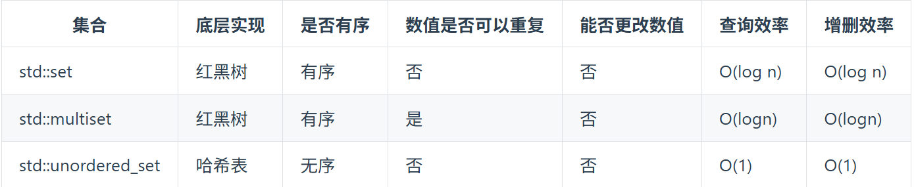

# defintion
* 哈希表`hash table` = 用`key`查询`value`,时间复杂度是$O(1)$
* 快速判断一个元素是否出现集合里
* 哈希函数`hash function` = 将变量映射为`hash table`上的`key`--键值/索引
  * step1：将实际的变量`variable`（通常不一定是数值变量），通过`HashCode`以特定编码方式，将其他数据格式转化为不同的数值 `= HashCode(variable)`
  * step2：将得到的数字进行处理（取模操作），得到对应在`hash table`中的`key/index`:`index=HashCode(variable) % tableSize`
* 当得到的数字数目大于`tableSize`时，避免不了会有几位学生的名字同时映射到哈希表 同一个索引下标的位置。
  * 也就会产生哈希碰撞`hash collision`
* 记数据规模=`dataSize`， 哈希表的大小=`tableSize`
* 哈希碰撞`hash collision`:两种解决方法
  * 拉链法
    * 小李和小王在索引1的位置发生了冲突，发生冲突的元素都被存储在链表中。 这样我们就可以通过索引找到小李和小王了
    * 要选择适当的哈希表的大小，这样既不会因为数组空值而浪费大量内存，也不会因为链表太长而在查找上浪费太多时间。
    * 
  * 线性探测法
    * 一定要保证tableSize大于dataSize。 我们需要依靠哈希表中的空位来解决碰撞问题。
    * 冲突的位置，放了小李，那么就向下找一个空位放置小王的信息。
    * 
* 总结
  * 当我们遇到了要快速判断一个元素是否出现集合里的时候，就要考虑哈希法。
  * 但是哈希法也是牺牲了空间换取了时间，因为我们要使用额外的数组，set或者是map来存放数据，才能实现快速的查找。

# hash可以使用的数据结构
* 数组:使用数组来做哈希的题目，需要题目限制了数值的大小。
  * 比如都是小写字母，开一个size=26的数组即可
* set （集合）
  * 速度要比数组慢，set把数值映射到key上都要做hash计算的。

* map(映射)

  * 键`key`不可以修改，值`val`可以修改