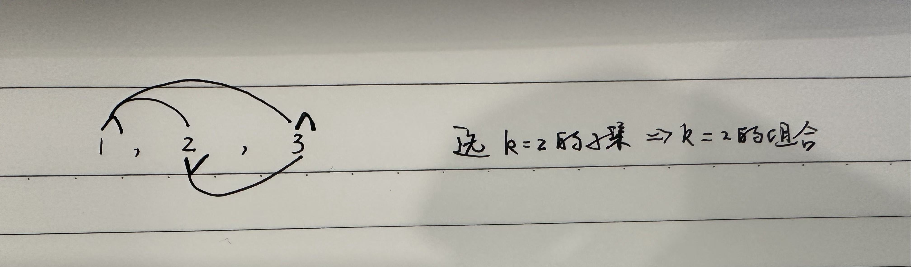

* 组合问题的常见三种变体形式
  * 形式一、**元素无重不可复选**，即 nums 中的元素都是唯一的，每个元素最多只能被使用一次，这也是最基本的形式。
    * 以组合为例，如果输入 nums = [2,3,6,7]，和为 7 的组合应该只有 [7]。
  * 形式二、**元素可重不可复选**，即 nums 中的元素可以存在重复，每个元素最多只能被使用一次。
    * 以组合为例，如果输入 nums = [2,5,2,1,2]，和为 7 的组合应该有两种 [2,2,2,1] 和 [5,2]。
    * 元素可重时，为了方便剪枝，一般需要先对全集元素进行排序
  * 形式三、**元素无重可复选**，即 nums 中的元素都是唯一的，每个元素可以被使用若干次。
    * 以组合为例，如果输入 nums = [2,3,6,7]，和为 7 的组合应该有两种 [2,2,3] 和 [7]。
* 根据最终的结果来看：
  * 组合/子集因为是无序的，所以[1,2]和[2,1]算重复解，不能多加。解决办法是
    * 形式一：使用start控制每轮可以选的数字列表在上层基础上依次往后移
    * 形式二：1、start控制；2、先给全集排序，然后对于树层重复的树枝进行剪枝，避免解集出现重复值。
    * 形式三：start控制，但下层可选的数字包含本层选过的(再上面是不行的)。
  * 排列因为是有序的，所以[1,2]和[2,1]算两个解，不能漏加。解决办法是
    * 形式一：每轮选择的数字都可以在全集中选择，但是对于同一纵向上的递归，通过<bool>used数组确保子代没有选直系父代选过的数字。
    * 形式二：1、used控制选过的元素不能再被复选；2、树层重复的数字也不能再被复选：添加控制条件，需要精确筛掉除了第一次出现以外的其他所有重复数字。
    * 形式三：相等于形式一的基础上，又放宽了可复选，所以不加任何控制即可。
* 排列、组合、子集问题都可以有这三种基本形式，所以共有 9 种变化。
  * 还有其他灵活的变体形式
  * 但本质就是穷举所有解，而这些解呈现树形结构，所以合理使用回溯算法框架即可。
  * 组合问题和子集问题其实是等价的：大小为 k 的组合就是大小为 k 的子集。
  * 三种变化形式，无非是在下面两棵树上剪掉或者增加一些树枝罢了。
  * 
  * 
* 回溯算法很容易超时，所以超时的时候，去思考看看当前的程序有哪些可以剪枝的优化。

# 总结思路
* 形式一、元素无重不可复选，即 nums 中的元素都是唯一的，每个元素最多只能被使用一次。
  * 组合/子集：结果无序，利用start索引控制每次只能在上一层选过的数字后面继续选。
  * 排列：结果有序，所以每一层理论上可以使用的数字都是全集，为了避免复选，可以使用used标记已选元素。
  ```cpp
  // 组合/子集问题回溯算法框架
  vector<vector<int>> res;
  vector<int>track;
  void backtrack(vector<int>& nums, int start) {
    res.push_back(track);
    for(int i=start;i<nums.size();i++){
      //做选择
      track.push_back(nums[i]);
      backtrack(nums,i+1);//用start控制下一层的选择列表
      // 撤销选择
      track.pop_back();
    }
  }
  //排列问题回溯算法框架
  vector<vector<int>> res;
  vector<int>track;
  vector<bool>used(nums.size(),false);
  void backtrack(vector<int>&nums){
    //base case
    if(track.size()==nums.size()){
      res.push_back(track);
      return;
    }
    for(int i=0;i<nums.size();i++){
      //剪枝，避免重复解
      if(used[i]){
        continue;
      }
      //做选择
      used[i] = true;
      track.push_back(nums[i]);
      backtrack(nums);
      //撤销选择
      track.pop_back();//从路径中移除选择
      used[i] = false;//将选择再次加入选择列表
    }
  }
  ```
* 形式二、元素可重不可复选，即 nums 中的元素可以存在重复，每个元素最多只能被使用一次，其关键在于排序和剪枝。
  * 排序是为了对于同一层：相同数值的元素只选一次，其余的剪掉，因为它们产生的结果集肯定是一样的  
  ```cpp
  // 组合/子集问题回溯算法框架
  ranges::sort(nums);
  vector<vector<int>> res;
  vector<int>track;
  void backtrack(vector<int>& nums, int start) {
    res.push_back(track);
    for(int i=start;i<nums.size();i++){
      // 剪枝逻辑，跳过值相同的相邻树枝，避免重复解
      if(i>start&&nums[i]==nums[i-1]){
        continue;
      }
      //做选择
      track.push_back(nums[i]);
      backtrack(nums,i+1);
      //撤销选择
      track.pop_back();
    }
  }
  //排列问题回溯算法框架
  ranges::sort(nums);
  vector<vector<int>> res;
  vector<int>track;
  vector<bool>used(nums.size(),false);
  void backtrack(vector<int>&nums){
    if(track.size()==nums.size()){
      res.push_back(track);
      return;
    }
    for(int i=0;i<nums.size();i++){
      //剪枝1：避免重复元素
      if(used[i]){
        continue;
      }
      // 剪枝，固定相同的元素在排列中的相对位置，跳过值相同的相邻树枝
      if(i>0&&nums[i]==nums[i-1]&&!used[i-1]){
        continue;
      }
      //做选择
      used[i] = true;
      track.push_back(nums[i]);
      backtrack(nums);
      //撤销选择
      track.pop_back();
      used[i] = false;
    }
  }
  ```
* 形式三、元素无重可复选，即 nums 中的元素都是唯一的，每个元素可以被使用若干次，只要删掉去重逻辑即可  
  * 
  ```cpp
  // 组合/子集问题回溯算法框架
  vector<vector<int>> res;
  vector<int> track;
  void backtrack(vector<int>& nums, int start) {
    res.push_back(track);
    for(int i=start;i<nums.size();i++){
      //做选择
      track.push_back(nums[i]);
      backtrack(nums,i);
      //撤销选择
      track.pop_back();
    }
  }
  //排列
  vector<vector<int>> res;
  vector<int> track;
  void backtrack(vector<int>&nums){
    if(track.size()==nums.size()){
      res.push_back(track);
    }
    for(int i=0;i<nums.size();i++){
      //做选择
      track.push_back(nums[i]);
      backtrack(nums);
      //撤销选择
      track.pop_back();
    }
  }
  ```
# 实际问题转化
* 所有的回溯题目本质上都是在遍历一棵决策树。
  * 决策树建模：想清楚怎么定义选择列表和路径
  * 结束条件`base case`一般比较简单
* 牢记下面代码框架即可，套框架应该套下面的，而不是上面的排列/组合/子集的框架(因为这个不具有普适性，本质上也是又下面的框架转化而来)
  * 回溯算法的代码框架：
  ```python
  result = []
  def backtrack(路径, 选择列表):
      if 满足结束条件:
          result.add(路径)
          return
      
      for 选择 in 选择列表:
        # 做选择：前序位置
        将该选择从选择列表移除
        路径.add(选择)
        backtrack(路径, 选择列表)
        # 撤销选择：后序位置
        路径.remove(选择)
        将该选择再加入选择列表
  ```